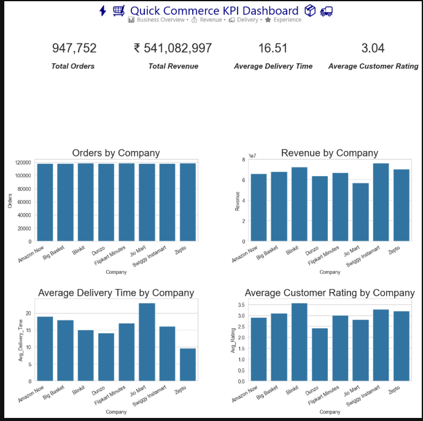
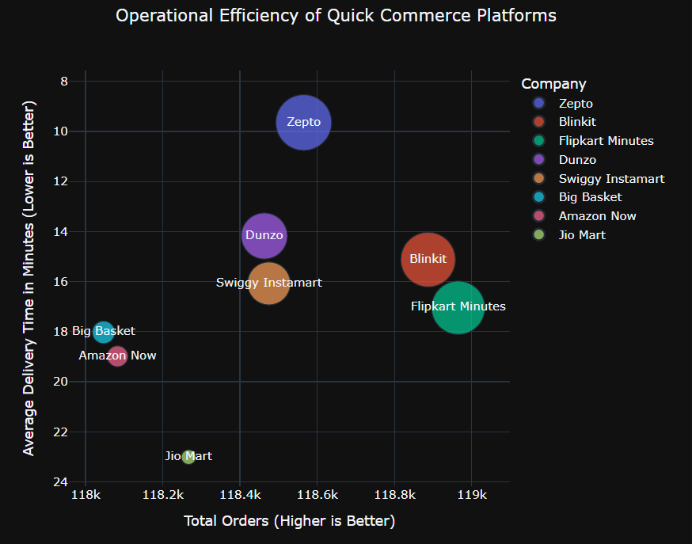
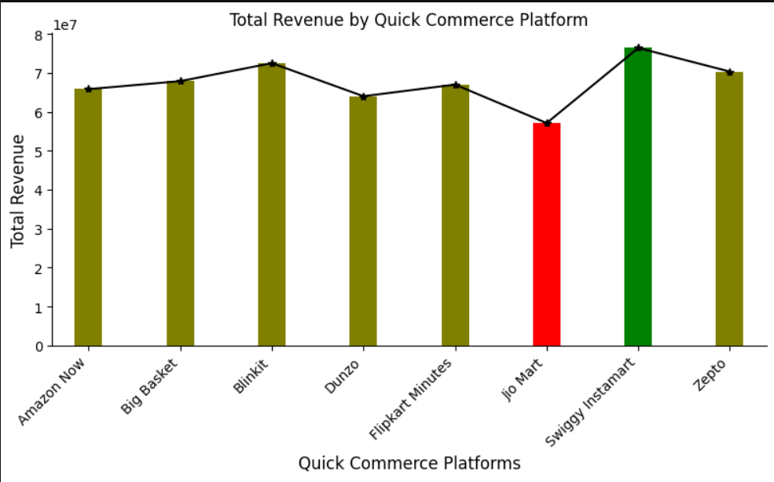
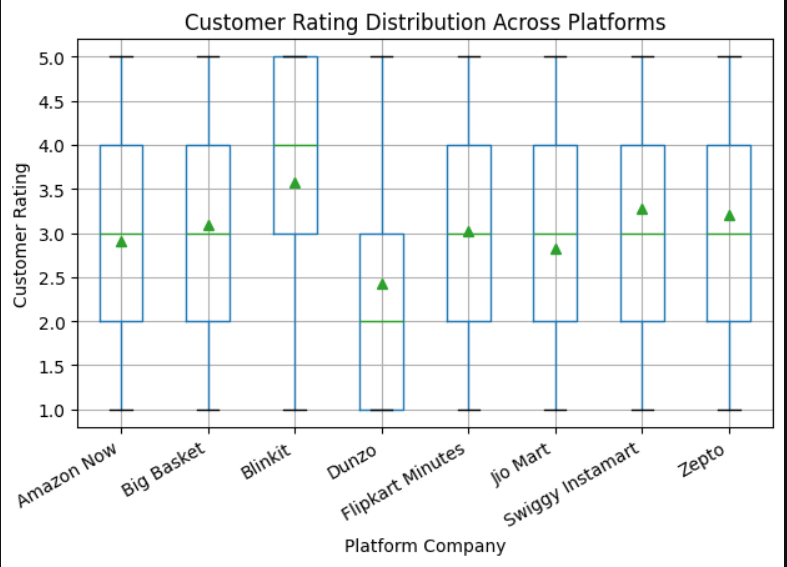

#  Quick Commerce Analytics & Operational Intelligence Project

##  Project Overview

This project is a large-scale **Quick Commerce (Q-Commerce) Business Analytics & Operational Intelligence Case Study** built using Python and advanced Exploratory Data Analysis (EDA) techniques.

The project simulates real-world operational and business scenarios inspired by major quick-commerce platforms such as:

- Blinkit
- Zepto
- Swiggy Instamart
- Amazon Now
- Flipkart Minutes

The analysis focuses on extracting meaningful business insights related to:

- Revenue generation
- Customer satisfaction
- Delivery efficiency
- Platform benchmarking
- Operational optimization
- Discount effectiveness
- Market expansion strategy
- KPI engineering

Unlike traditional EDA projects that stop at visualizations, this project emphasizes:

# business interpretation, operational reasoning, and strategic decision-making.

---

#  Business Objectives

The primary goals of this project were:

- Identify the highest revenue-generating platforms
- Analyze customer spending behavior
- Understand operational efficiency
- Study the impact of delivery speed on satisfaction
- Evaluate discount effectiveness
- Benchmark platform performance
- Identify scalable expansion markets
- Build KPI-driven business dashboards
- Generate real-world operational insights

---

#  Dataset Information

## Dataset Overview

| Metric | Value |
|---|---|
| Total Records | ~1 Million |
| Total Features | 13 |
| Industry Domain | Quick Commerce / E-Commerce |
| Dataset Type | Synthetic Realistic Business Dataset |

---

#  Features Used

| Feature | Description |
|---|---|
| Order_ID | Unique order identifier |
| Company | Quick commerce platform |
| City | Delivery city |
| Customer_Age | Customer age |
| Order_Value | Total order amount |
| Delivery_Time_Min | Delivery time in minutes |
| Distance_Km | Delivery distance |
| Items_Count | Number of items purchased |
| Product_Category | Purchased category |
| Payment_Method | Mode of payment |
| Customer_Rating | Customer satisfaction score |
| Discount_Applied | Discount usage indicator |
| Delivery_Partner_Rating | Delivery partner performance rating |

---

#  Technologies & Libraries Used

## Programming Language
- Python

## Libraries Used

```python
pandas
numpy
matplotlib
seaborn
plotly
```

---

#  Data Cleaning & Preprocessing

The dataset contained several real-world data quality challenges.

## Cleaning Operations Performed

###  Missing Value Handling
Handled missing values using:
- group-wise imputation
- statistical replacement
- consistency validation

###  Data Type Optimization
- Optimized memory usage
- Standardized numerical datatypes
- Improved processing efficiency

###  Outlier Analysis
- Used boxplots for detection
- Preserved business-valid extreme values
- Avoided unnecessary information loss

###  Data Standardization
- Standardized categorical labels
- Improved formatting consistency
- Cleaned dashboard-ready data structure

---

#  Exploratory Data Analysis (EDA)

The project contains extensive business-oriented EDA focused on operational intelligence and decision support.

---

#  Dashboard Preview

## Quick Commerce KPI Dashboard



---

#  Project Visuals

## Operational Efficiency Bubble Analysis


## Revenue Analysis by Platform


## Customer Rating Distribution


---

# 1. Revenue Analysis by Platform

## Objective
To identify the strongest revenue-generating quick-commerce companies.

## Key Findings

- Swiggy Instamart generated the highest total revenue.
- Blinkit and Zepto showed highly competitive performance.
- Jio Mart consistently underperformed across multiple business KPIs.

## Business Interpretation

Higher revenue indicates:
- stronger customer retention
- efficient operations
- better monetization
- stronger market penetration

The analysis also revealed that revenue leadership correlates strongly with:
- delivery performance
- customer satisfaction
- operational consistency

---

# 2. Average Order Value (AOV) Analysis

## Objective
To compare customer spending patterns across platforms.

## Key Findings

- Swiggy Instamart had the highest Average Order Value (AOV).
- Jio Mart showed the lowest customer spending behavior.
- Higher-performing platforms maintained stronger basket sizes.

## Strategic Insight

AOV is one of the most critical profitability metrics in quick commerce because:
- delivery costs remain relatively fixed,
- while larger basket sizes improve margins.

Higher AOV helps:
- improve operational profitability
- reduce delivery burden
- increase revenue efficiency

---

# 3. Customer Rating Distribution Analysis

## Objective
To analyze customer satisfaction consistency across companies.

## Key Findings

- Blinkit showed the strongest rating distribution.
- Dunzo demonstrated weaker satisfaction consistency.
- Zepto and Swiggy maintained stable customer experience quality.

## Advanced Insight

Instead of relying only on averages, boxplot distribution analysis revealed:
- customer sentiment variability
- rating consistency
- operational reliability
- experience stability

This improved analytical depth significantly.

---

# 4. Delivery Time Impact Analysis

## Objective
To understand how delivery speed affects customer and delivery partner satisfaction.

## Key Findings

- Faster deliveries consistently received better ratings.
- Ratings remained relatively stable within acceptable delivery thresholds.
- Customer satisfaction declined significantly after longer delays.

## Important Analytical Observation

The relationship between:
- delivery time
- customer satisfaction

was identified as:

# non-linear.

This indicates:
- customers tolerate moderate delays,
- but experience deteriorates rapidly after threshold violations.

---

# 5. Discount Impact Analysis

## Objective
To evaluate whether discounts improve order performance.

## Key Findings

Orders with discounts:
- generated higher Average Order Value
- attracted larger basket spending

However:
- discounts did not necessarily improve overall operational profitability.

## Strategic Interpretation

Discounts are highly effective for:
- customer acquisition
- increasing basket value
- short-term engagement

But excessive discounting may:
- reduce margins
- increase dependency behavior
- impact profitability negatively

---

# 6. Operational Efficiency Analysis

## Objective
To benchmark company-level operational performance.

## Efficiency Factors Considered
- delivery speed
- order handling efficiency
- platform scalability

## Top Operational Performers
- Zepto
- Blinkit
- Flipkart Minutes

## Weak Operational Performers
- Jio Mart
- Amazon Now
- Big Basket

## Business Insight

This section introduced:

# operational benchmarking,

which is widely used in real-world analytics teams for:
- logistics optimization
- scalability analysis
- performance comparison

---

# 7. Bubble Chart Multi-Metric Analysis

One of the strongest visual analyses in the project combined:

- Total Orders
- Delivery Time
- Revenue
- Platform Comparison

into a single operational intelligence visualization.

## Major Insights

### Zepto
- fastest delivery performance
- high operational efficiency
- scalable logistics system

### Blinkit
- strong revenue generation
- high order density
- balanced execution

### Jio Mart
- slower deliveries
- weaker operational efficiency
- lower monetization capability

---

# 8. Best Expansion Cities Analysis

## Objective
To identify cities with the strongest growth and expansion potential.

## Top Expansion Markets
- Gurgaon
- Chennai
- Pune
- Bengaluru
- Kolkata

## Business Interpretation

Top-performing cities showed:
- strong order density
- efficient logistics support
- higher customer engagement
- scalable infrastructure

This section simulated:

# market expansion intelligence

commonly used in strategic business operations.

---

#  Dashboard & KPI Engineering

A complete Quick Commerce KPI Dashboard was built containing:

## Executive KPIs
- Total Orders
- Total Revenue
- Average Delivery Time
- Average Customer Rating

## Dashboard Features
- Company-wise benchmarking
- Revenue tracking
- Delivery analysis
- Customer satisfaction insights
- KPI-driven reporting
- Business storytelling

---

#  Advanced Business Insights

## Operational Intelligence

### Faster Delivery Leads To
- higher customer satisfaction
- stronger retention
- improved platform trust

### Longer Delivery Times Cause
- operational inefficiency
- customer dissatisfaction
- lower repeat purchases

---

## Customer Behavior Insights

### Discounted Users
- spend more per order
- generate larger basket sizes

### High-Rating Platforms
typically maintain:
- better logistics systems
- stronger fulfillment quality
- more stable customer experience

---

## Strategic Insights

Successful quick-commerce platforms consistently demonstrate:
- operational efficiency
- high Average Order Value
- fast delivery
- customer satisfaction consistency

---

#  Visualization Techniques Used

| Visualization | Purpose |
|---|---|
| Bar Charts | KPI & revenue comparison |
| Line Charts | Trend analysis |
| Bubble Charts | Multi-variable operational analysis |
| Box Plots | Rating variability & consistency |
| Grouped Bar Charts | Customer sentiment comparison |
| Dashboard Visuals | Executive-level reporting |

---

#  Key Strengths of the Project

##  Business-Focused EDA
The project emphasizes:
- business reasoning
- operational analytics
- decision-making intelligence

instead of only chart creation.

---

##  Operational Analytics
The project includes:
- efficiency benchmarking
- delivery optimization analysis
- platform comparison logic

which significantly improves analytical maturity.

---

##  KPI Engineering
The dashboard demonstrates:
- executive reporting structure
- business storytelling
- operational intelligence

---

##  Multi-Metric Intelligence
The project successfully connects:
- revenue
- ratings
- delivery efficiency
- operational performance

to generate deeper strategic insights.

---

#  Limitations & Future Improvements

Although the project demonstrates strong analytical depth, several advanced enhancements can further improve it.

## Potential Future Improvements

###  Predictive Modeling
- delivery time prediction
- customer rating prediction
- order forecasting

###  Customer Segmentation
- high-value customers
- discount-sensitive users
- loyal customer analysis

###  Time-Series Analysis
- monthly growth trends
- seasonal patterns
- peak-hour demand analysis

###  Financial Analytics
- profitability modeling
- margin estimation
- CAC analysis
- unit economics

###  Advanced Feature Engineering
Potential engineered metrics:
- revenue per kilometer
- customer lifetime value
- city efficiency score
- order density metrics

---

#  Real-World Business Applications

This project can help companies:
- optimize logistics systems
- improve delivery operations
- enhance customer satisfaction
- design smarter discount strategies
- identify scalable expansion markets
- improve operational decision-making

---

#  Skills Demonstrated

## Technical Skills
- Python
- Pandas
- NumPy
- Matplotlib
- Seaborn
- Plotly
- Data Cleaning
- EDA
- Dashboard Analytics

## Analytical Skills
- Business Intelligence
- KPI Engineering
- Operational Analytics
- Customer Behavior Analysis
- Strategic Thinking
- Insight Generation
- Business Storytelling

---

#  Project Structure

```bash
Quick-Commerce-Analytics/
│
├── data/
│   ├── quick_commerce_raw.csv
│   └── quick_commerce_cleaned.csv
│
├── notebooks/
│   └── quick_commerce_analysis.ipynb
│
├── images/
│   ├── dashboard.png
│   ├── efficiency_bubble_chart.png
│   ├── revenue_analysis.png
│   └── customer_rating_analysis.png
│
├── README.md
└── requirements.txt
```

---

#  Conclusion

This project demonstrates how data analytics can solve real-world operational and business problems in the rapidly growing Quick Commerce industry.

The analysis highlights how:
- delivery speed
- operational efficiency
- customer satisfaction
- revenue optimization
- Average Order Value

collectively influence platform success.

The project reflects strong capabilities in:
- business analytics
- operational intelligence
- KPI engineering
- visualization
- strategic interpretation

making it highly valuable for roles such as:
- Data Analyst
- Business Analyst
- Product Analyst
- Operations Analyst

---

#  Author

## Himanchal mishra
Engineering Student | Aspiring Data Analyst & ML Enthusiast

---

#  If you found this project insightful, consider giving it a star!
